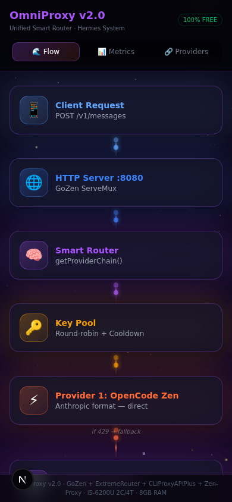
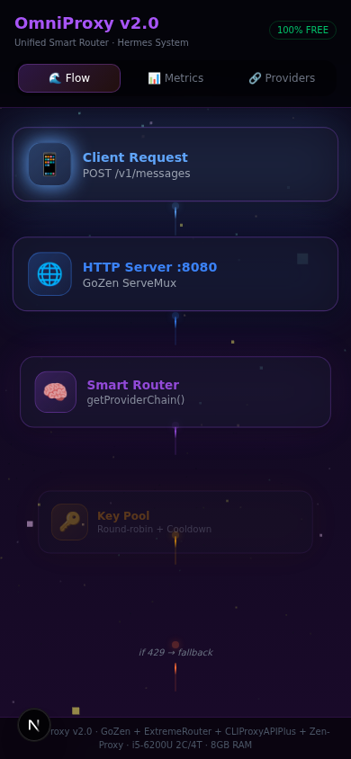
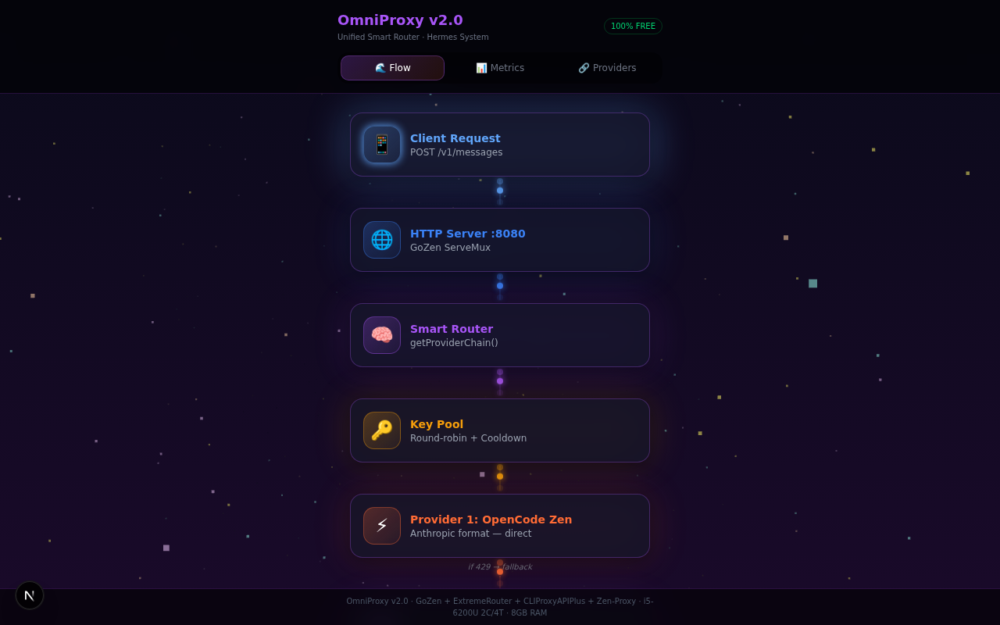

<p align="center">
  
  
  
  
  
  
  <br />
  
  
  
</p>

<h1 align="center">OmniProxy v2.0 &mdash; Free AI API Smart Router</h1>

<p align="center">
  <strong>Interactive Infographic-Motion Flowchart</strong> for a Unified Multi-Provider AI API Gateway with Automatic Fallback, Format Translation &amp; Real-Time SSE Streaming
</p>

<p align="center">
  <a href="#live-demo">Live Demo</a> &bull;
  <a href="#architecture">Architecture</a> &bull;
  <a href="#features">Features</a> &bull;
  <a href="#tech-stack">Tech Stack</a> &bull;
  <a href="#getting-started">Getting Started</a> &bull;
  <a href="#deployment">Deployment</a>
</p>

---

## Overview

**OmniProxy v2.0** is a visually stunning, interactive flowchart application that visualizes the complete architecture of a unified AI API smart router (codename: *Hermes System*). Built as a mobile-first Next.js 16 web app, it renders the entire request lifecycle &mdash; from client request through provider chain selection, key pool rotation, format translation (Anthropic &harr; OpenAI), and real-time SSE stream delivery &mdash; as an animated infographic with a deep-space particle background.

The app connects live to an OmniProxy backend's `/health` and `/metrics` endpoints and falls back gracefully to rich demo data when the proxy is offline.

### Why OmniProxy?

Running multiple AI API providers (Anthropic, OpenAI, OpenRouter) separately is expensive and fragile. OmniProxy merges them into a **single Go binary** (~15-25MB RAM) that provides:

- **Zero-downtime fallback** &mdash; automatic provider chain with 429/5xx detection
- **Invisible format translation** &mdash; Anthropic clients talk to OpenAI providers seamlessly
- **Intelligent key pooling** &mdash; round-robin with per-key cooldown and failure tracking
- **Real-time streaming** &mdash; SSE chunks translated and flushed line-by-line

This flowchart app lets you **see** all of that happening in real time.

---

## Live Demo

| Platform | URL |
|----------|-----|
| **Vercel** | [omniproxy-ai-smart-router.vercel.app](https://omniproxy-ai-smart-router.vercel.app) |
| **GitHub Pages** | [marktantongco.github.io/omniproxy-ai-smart-router](https://marktantongco.github.io/omniproxy-ai-smart-router) |

---

## Screenshots

### Mobile (375px)

The app is designed mobile-first with a vertical scrolling flowchart, staggered card animations, and tap-to-expand details.

<p align="center">
  
</p>

### Metrics Dashboard

Live-updating counters, success rate progress bar, and per-provider key pool status.

<p align="center">
  
</p>

### Desktop (1280px)

Responsive layout that expands gracefully to larger screens with the same animated particle background.

<p align="center">
  
</p>

---

## Architecture

The flowchart visualizes the **3 mergers** that produced OmniProxy v2.0:

| Merge | Source Projects | What It Adds |
|-------|----------------|-------------|
| **Merge 1** | GoZen + ExtremeRouter | Single Go binary, zero IPC, ~15-25MB RAM |
| **Merge 2** | Zen-Proxy | Invisible Anthropic &harr; OpenAI format translation with real-time SSE streaming |
| **Merge 3** | CLIProxyAPIPlus | In-memory key pool, round-robin rotation, per-key cooldown timers |

### Request Flow (10 Nodes)

```
Client Request
     │  POST /v1/messages
     ▼
HTTP Server (:8080)
     │  GoZen ServeMux, 10MB body limit
     ▼
Smart Router
     │  getProviderChain() — format-aware priority
     ▼
Key Pool
     │  Round-robin + 60s cooldown per key
     ▼
Provider 1: OpenCode Zen  ← Anthropic format (direct passthrough)
     │  if 429 → fallback
     ▼
Translation Layer  ← Anthropic ↔ OpenAI (only for non-native providers)
     │
     ▼
Provider 2: OpenCode Go  ← OpenAI format (translated)
     │  if exhausted → fallback
     ▼
Provider 3: OpenRouter  ← Free models (mistral-7b, llama-3.1-8b, gemma-2-9b)
     │
     ▼
SSE Stream Translation
     │  delta.content → text_delta, line-by-line flush
     ▼
Client Response
     │  Streaming tokens delivered — client never knows translation occurred
```

---

## Features

### Interactive Flowchart
- **10 animated nodes** representing the full request lifecycle
- **Tap/click to expand** each node for technical details
- **Color-coded providers** — coral (Anthropic format), emerald (OpenAI format), purple (translation layer)
- **Animated flow connections** with flowing particle effects between nodes

### Real-Time Metrics Dashboard
- **Live counters** — requests, successes, failures, fallbacks with animated number transitions
- **Success rate bar** — gradient progress bar (coral → neon green)
- **Per-provider key pool status** — format badges, available/total key counts
- **Auto-polling** — fetches from `/metrics` and `/health` every 3 seconds

### Provider Chain View
- **Priority-ordered provider cards** with active/cooldown status indicators
- **Per-key statistics** — usage count, failure count, cooldown timer (READY / CD 23s)
- **Fallback logic documentation** — visual explanation of 429/5xx → exhaustion → 503 chain

### Visual Design
- **Three.js particle background** — 800 particles (coral, emerald, purple, gold) with additive blending on a deep-space gradient
- **Framer Motion animations** — staggered node entrance (spring physics), pulsing glow on active nodes, smooth tab transitions
- **Glassmorphism cards** — `backdrop-blur-md` with translucent backgrounds and colored borders
- **Custom scrollbar** — purple-themed to match the overall color system

### Smart Fallback
- **Demo mode** — when the OmniProxy backend is offline, the app automatically switches to realistic mock data (1,247 requests, 94.9% success rate)
- **Status indicator** — pulsing green dot (ONLINE) or red dot (DEMO MODE) in the metrics header

---

## Tech Stack

| Category | Technology | Version |
|----------|-----------|---------|
| **Framework** | Next.js (App Router) | 16.1 |
| **Language** | TypeScript | 5.x |
| **3D Graphics** | Three.js + @react-three/fiber | 0.185 / 9.6 |
| **Animation** | Framer Motion | 12.42 |
| **Styling** | Tailwind CSS | 4.x |
| **UI Components** | shadcn/ui (Radix primitives) | latest |
| **Icons** | Lucide React | 1.25 |
| **State** | React hooks (useState, useEffect, useCallback) | built-in |
| **Build** | Bun / Turbopack | latest |

---

## Project Structure

```
omniproxy-ai-smart-router/
├── public/
│   ├── preview-mobile.png
│   ├── preview-metrics.png
│   ├── preview-desktop.png
│   └── robots.txt
├── src/
│   ├── app/
│   │   ├── globals.css          # Dark theme CSS variables, custom scrollbar
│   │   ├── layout.tsx           # Root layout with dark mode, viewport meta
│   │   └── page.tsx             # Main page — 3-tab flowchart app
│   ├── components/
│   │   ├── ThreeBackground.tsx  # Three.js particle field (800 particles, additive blending)
│   │   ├── FlowNode.tsx         # Interactive expandable node card with glow animation
│   │   ├── FlowConnection.tsx   # Animated vertical connector with flowing particles
│   │   ├── MetricsPanel.tsx     # Live metrics dashboard (counters, rate bar, key pool)
│   │   └── ProviderChainDetail.tsx  # Provider priority cards with per-key stats
│   ├── hooks/
│   │   └── useProxyMetrics.ts   # Polling hook for /metrics + /health + DEMO_METRICS
│   └── lib/
│       ├── types.ts             # TypeScript interfaces (KeyState, ProviderMetrics, etc.)
│       ├── constants.ts         # COLORS palette, FLOW_NODES array (10 nodes)
│       └── utils.ts             # Utility functions (cn helper)
├── next.config.ts               # Next.js config with Three.js transpilation
├── tailwind.config.ts
├── tsconfig.json
├── package.json
└── README.md
```

---

## Getting Started

### Prerequisites

- **Node.js** 18+ or **Bun** 1.3+
- **npm** or **bun** package manager

### Installation

```bash
# Clone the repository
git clone https://github.com/marktantongco/omniproxy-ai-smart-router.git
cd omniproxy-ai-smart-router

# Install dependencies
bun install
# or: npm install

# Start the development server
bun run dev
# or: npm run dev
```

Open [http://localhost:3000](http://localhost:3000) in your browser.

### Environment Variables

| Variable | Default | Description |
|----------|---------|-------------|
| `NEXT_PUBLIC_PROXY_URL` | `http://localhost:8080` | URL of the running OmniProxy Go backend for live metrics |

Create a `.env.local` file:

```env
NEXT_PUBLIC_PROXY_URL=http://localhost:8080
```

> If the proxy is not running, the app automatically switches to demo mode with realistic mock data.

### Connecting to a Live OmniProxy Backend

1. Start your OmniProxy Go binary: `./omni-proxy -config config.json`
2. Set `NEXT_PUBLIC_PROXY_URL` to the proxy's address
3. The Metrics and Providers tabs will show live data

---

## Deployment

### Vercel (Recommended)

[](https://vercel.com/new/clone?repository-url=https://github.com/marktantongco/omniproxy-ai-smart-router)

The app deploys as a standard Next.js project on Vercel with zero configuration:

```bash
# Install Vercel CLI
npm i -g vercel

# Deploy
vercel --prod
```

### GitHub Pages

The app supports static export for GitHub Pages deployment:

```bash
# Build static export
npm run build:static

# Deploy to GitHub Pages
npm run deploy:ghpages
```

Or enable GitHub Pages in your repository settings:
1. Go to **Settings → Pages**
2. Set **Source** to **GitHub Actions**
3. The included workflow will build and deploy automatically

---

## Color System

| Role | Color | Hex |
|------|-------|-----|
| Background gradient start | Deep space | `#0a0a1a` |
| Background gradient end | Dark purple | `#1a0a2a` |
| Anthropic format | Coral | `#ff6b35` |
| OpenAI format | Emerald | `#00d9a3` |
| Translation layer | Purple | `#a855f7` |
| Streaming / Gold | Gold | `#ffd700` |
| Error / Cooldown | Hot pink | `#ff3366` |
| Success | Neon green | `#00ff88` |

---

## Browser Support

| Browser | Version |
|---------|---------|
| Chrome | 90+ |
| Firefox | 90+ |
| Safari | 15+ |
| Edge | 90+ |
| Mobile Chrome | 90+ |
| Mobile Safari | 15+ |

---

## Performance

- **Three.js** loaded via `dynamic()` import with SSR disabled — no hydration mismatch
- **Framer Motion** `AnimatePresence` with `mode="wait"` for clean tab transitions
- **Polling interval** set to 3 seconds to balance freshness with network usage
- **No external API calls** on initial load — all flowchart data is static constants
- **Particle count** capped at 800 for smooth 60fps on mobile devices

---

## License

MIT License &mdash; free for personal and commercial use.

---

<p align="center">
  Built with ❤️ by <a href="https://github.com/marktantongco">marktantongco</a>
  <br />
  OmniProxy v2.0 &middot; GoZen + ExtremeRouter + CLIProxyAPIPlus + Zen-Proxy
</p>